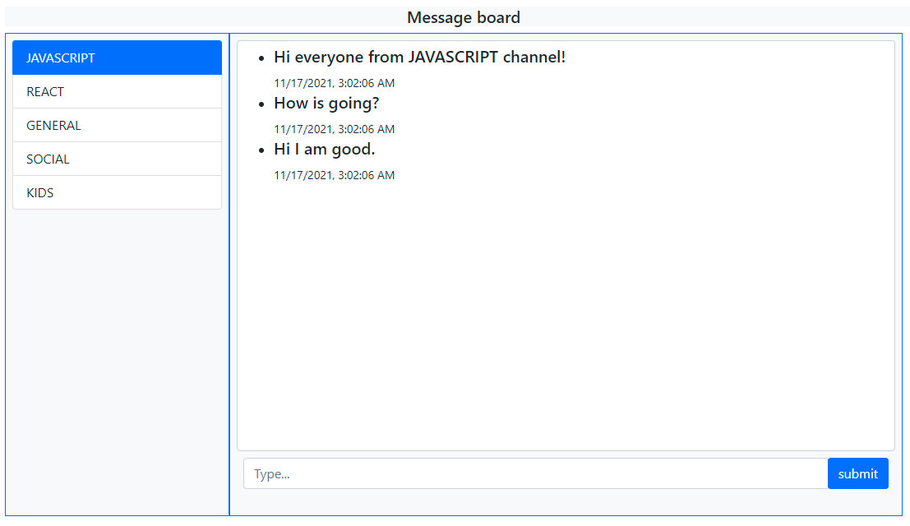

# Message board project

This project created as a messenger board sample. The Message board use a simple rate limitaion protection which is protect from more that a specified request from a same IP address to the server and alse a simple spam detection which doesn't let clients use spam words in their chat (in this sample spam words are some fruits name like apple, pear, watermelon,...) in their chats. 
Nodejs, React, Redux, Thunk are technologies that hase been used in the code.

## Available Scripts

In the project directory, you can run:

### `npm run start`

Runs the app in the development mode.\
Open [http://localhost:3000](http://localhost:3000) to view it in the browser.

The page will reload if you make edits.\
You will also see any lint errors in the console.

### `npm run dev or npm run prod`

Runs the back-end part.\
Open back-end folder in src folder then run the script to open [http://localhost:8080](http://localhost:8080) to view it in the browser.
In this part client could connect and communicate with socket server.

### `npm run build`

Builds the app for production to the `build` folder.\
It correctly bundles React in production mode and optimizes the build for the best performance.

The build is minified and the filenames include the hashes.\
Your app is ready to be deployed!

